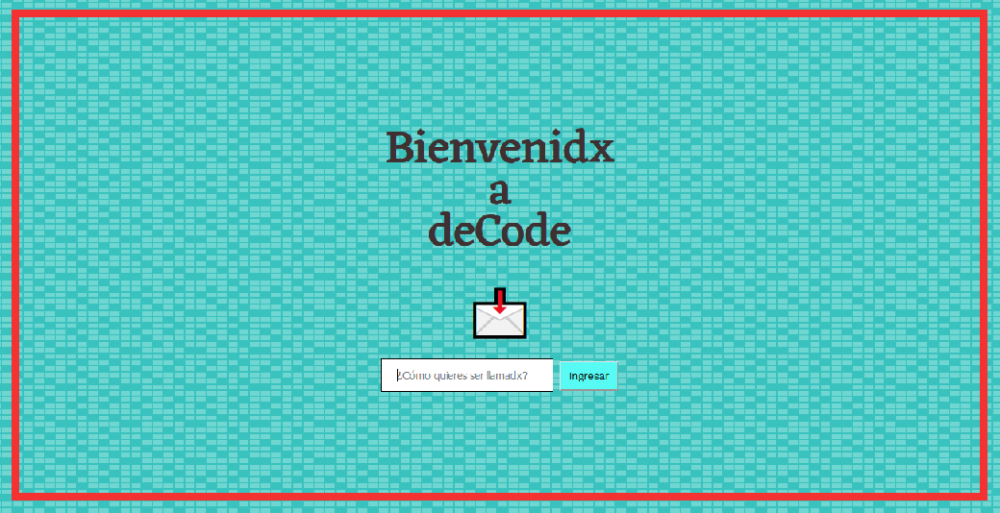

# * **DeCode** APP 🔑📧
```text
* deCode es un proyecto que busca facilitar el envío y recepción de mensajes encriptados, 
mediante una interfaz web clara, simple y precisa. Creemos en una internet libre y anónima, 
por lo que nos enfocamos en apoyar con este sistema de encriptado a colectivos e individuos 
que, por motivos políticos o activismo, requieren de anonimato en su comunicación interna, sin ser perseguidos ni vigilados por terceros.
```

## 🔷 Resumen del Proyecto
deCode es un aplicación web desarrollada en Santiago de Chile, en el marco del primer proyecto del bootcamp Front End Developer de Laboratoria. Permite ingresar mensajes en castellano (en la versión demo no soporta la ñ y caracteres especiales), para luego ser codificados mediante un sistema de cifrado conocido como [César](https://en.wikipedia.org/wiki/Caesar_cipher). 

Este es uno de los primeros métodos de cifrado conocidos, de los más simples de trabajar pero con alto potencial a la hora de generar mensajes ocultos. Consiste en-.......


## 🔷 Cómo Utilizar deCode 

**IMPORTANTE** 

**Antes de comenzar a usar deCode, recuerda que es de uso privado. Esto implica, que si no posees de antemano el código deCode de la persona que te envía el mensaje, no podrás visualizar lo que están queriendo hacerte llegar. Osea, si alguien te envía un texto cifrado y o ingresas en la página, sin poseer el código, deCode te alertará de la falta de este, y no entregará la decodificación. Por tanto, recuerda no perdrlo ;)**

**Por cierto, cuando seas tú quien desea anonimizar un mensaje, deCode te entregará un código único para ti, que deberás enviar a tu/s destinatarix/xs**

* Tal como se muestra en la imágen de cabecera, la primera interfaz de la aplicación muestra una bienvenida simple y clara, junto a la caja de texto invitando a escribir el nombre del usuario, para así entregar una experiencia más personalizada

* Es posible, entonces, escoger entre tres botones: Cifrado, Descifrado y Recursos. Las dos primeras opciones serán explicadas en la instrucción siguiente, mientras que el tercero, llevará al usuario a una página exterior con información adicional que suma a la tarea de mantenerse anónimo en internet, y así complementar la necesidad de quienes llegan a nuestra aplicación.

* Ahora, a lo que nos concierne. Si lo que deseas es *Cifrar*, osea, introducir un mensaje "en español" para obtener de vuelta el mismo pero cifrado, decanta por ese botón. Se desplegará una caja que contiene los espacios para los textos, y una pequeña que servirá para introducir el número secreto que fue enviado con anterioridad

Sea cualquiera de las dos funciones que busques, deCode te entregará una solución fácil y rápida para mensajes, sin importar su extensión (ni contenido 💗)


## 🔷 Usuarios de *deCode
Desde un comienzo nuestro usuario ideal se mantuvo intacto: individuxs y colectivos políticos y/o activistas, cuyos proyectos pueden ser perseguidos o sancionados si no actúan con anonimato. 

Este usuario es alguien que maneja conceptos previos, como ciberseguridad, anonimato e internet libre, por ejemplo. Al presuponer esto, no es necesaria mayor explicación sobre el cifrado y su necesidad: nuestros usuarixs llegan a deCode sabiendo lo que necesitan. Eso explica también nuestra necesidad de hacer una app simple e intuitiva, centrandonos en su función principal.


## 🔷 Proceso de Desarrollo de *deCode

Una vez comprendida la necesidad de nuestro usuario, partimos con el desarrollo de un prototipo de baja fidelidad, como muestra la siguiente imágen.

En esta fase consideramos todas las interacciones y funcionalidades que queremos darle a *deCode en su implementación final, por lo que no todas se encuentran aún en la actual versión demo.

En nuestra próxima actualización, incluiremos:
* Generación automática de códigos aleatorios cada vez que se cifre/descifre un mensaje
* Permitir enviar estos mediante mensajes por Telegram, con el fin de agilizar la transmisión la comunicación entre los usuarios

* Páginas HTML separadas para cada acción que realice el usuario

* Desarrollar, al menos en su primera fase, una aplicación Android/iOS


## *Recursos sobre Ciberseguridad* 💻 